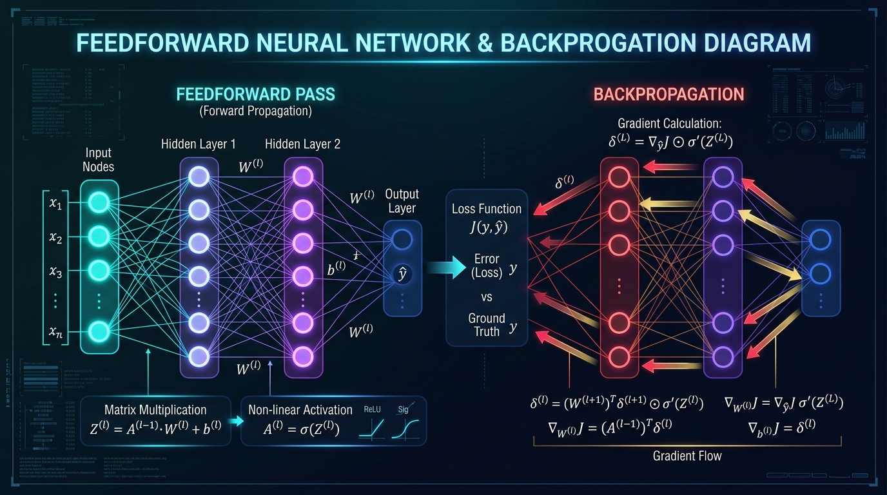
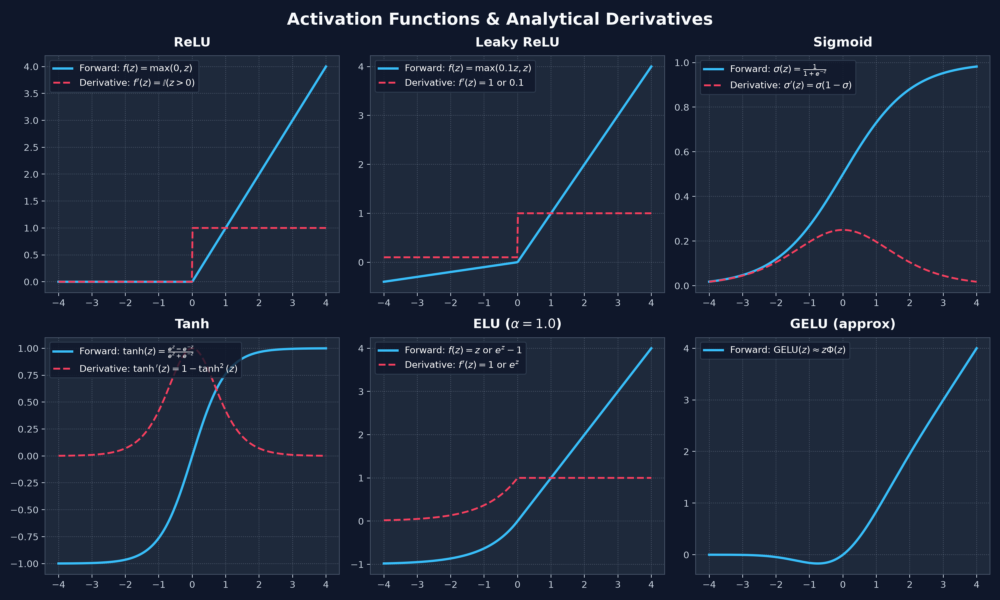
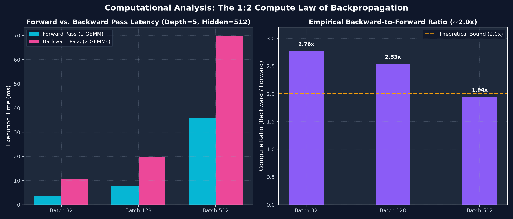
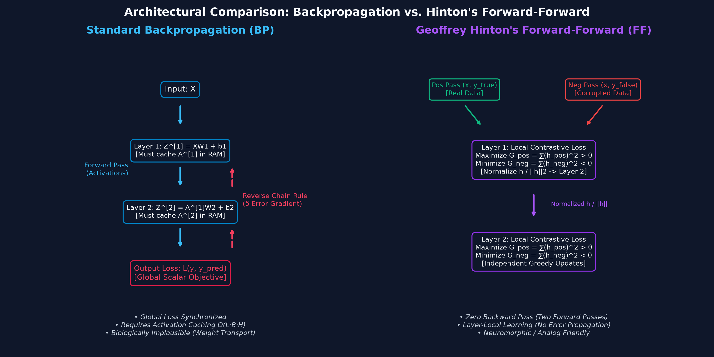
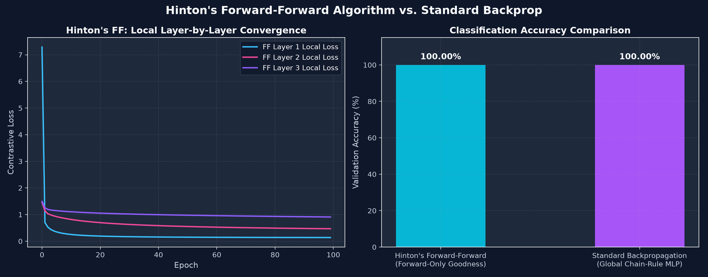
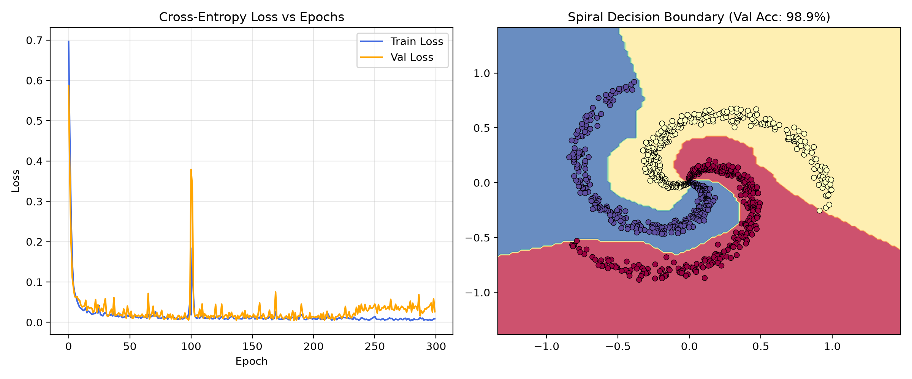
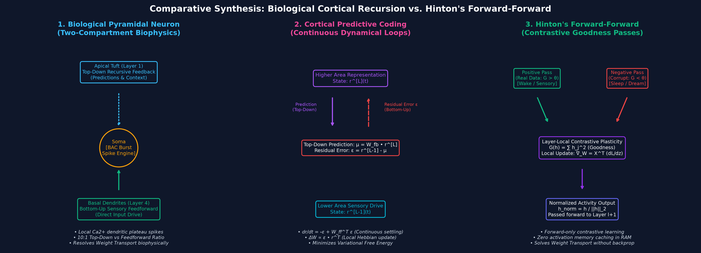
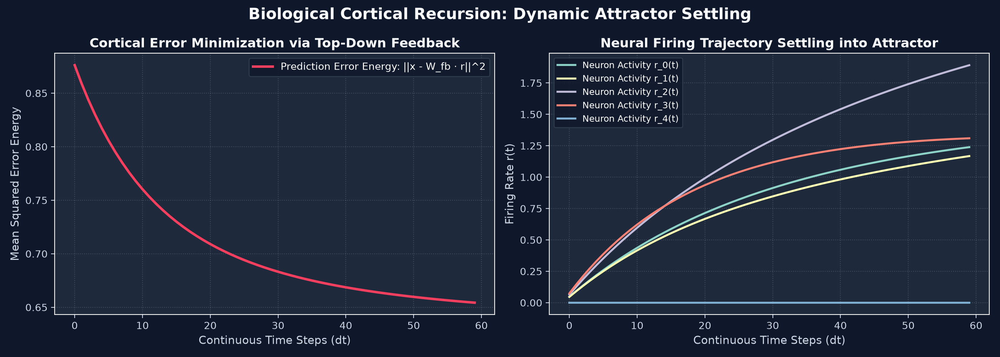

<div align="center">

# Feedforward Neural Network (FFNN) from Scratch in Python

[](https://www.python.org/)
[](https://numpy.org/)
[](https://pytest.org/)
[](LICENSE)

<br/>



<p align="center">
  <b>A modular, high-performance, from-scratch implementation of Feedforward Neural Networks (MLPs) & Geoffrey Hinton's Forward-Forward (FF) Algorithm in Python.</b><br/>
  Featuring analytical backpropagation, local contrastive goodness learning, numerical gradient checking, modern optimizers, and deep computational/neuromorphic hardware complexity analysis.
</p>

[📚 Standard FFNN Guide](FEEDFORWARD_NEURAL_NETWORK.md) • [🧠 Hinton's Forward-Forward Guide](HINTON_FORWARD_FORWARD_COMPARISON.md) • [🧬 Biological Recursion vs FF Guide](BIOLOGICAL_RECURSIVE_FEED_VS_FORWARD_FORWARD.md) • [🚀 Quickstart](#-quickstart) • [🧪 Benchmarks](#-empirical-benchmarks)


</div>

---

## 🌟 Highlights

- **Pure NumPy Core**: Transparent matrix calculus and tensor operations without heavy black-box autograd frameworks.
- **Analytical Backpropagation Engine**: Exact multivariate chain-rule gradient derivations verified via two-sided finite-difference gradient checking ($\text{Rel Error} < 10^{-5}$).
- **Production-Ready Modularity**: Decoupled `Dense` layers, activations (`ReLU`, `LeakyReLU`, `Sigmoid`, `Tanh`, `Softmax`), and stabilized losses (`MSE`, `BCE`, `Categorical Cross-Entropy`).
- **First-Class Optimizers**: Built-in implementations of `SGD` (with Nesterov/Momentum), `RMSprop`, and `Adam` with bias corrections.
- **Isolated Virtual Environment**: One-command reproducible setup via `setup_env.sh` and Python `venv`.

---

## 📐 Architecture & Mathematical Mechanics

### 1. Forward Propagation
Information flows unidirectionally across $L$ parameterized layers without recurrent cycles:

$$\mathbf{Z}^{[l]} = \mathbf{A}^{[l-1]} \mathbf{W}^{[l]} + \mathbf{b}^{[l]}$$
$$\mathbf{A}^{[l]} = g^{[l]}(\mathbf{Z}^{[l]})$$

Where $\mathbf{X} = \mathbf{A}^{[0]} \in \mathbb{R}^{B \times D_{in}}$, $\mathbf{W}^{[l]} \in \mathbb{R}^{D_{in} \times D_{out}}$, and $\mathbf{b}^{[l]} \in \mathbb{R}^{1 \times D_{out}}$.

<div align="center">
  
</div>

---

### 2. Analytical Backpropagation (Chain Rule)

Backpropagation computes the gradient of scalar loss $\mathcal{L}$ with respect to all parameters in reverse topological order:

1. **Output Sensitivity Adjoint ($\boldsymbol{\delta}^{[L]}$)**:
   $$\boldsymbol{\delta}^{[L]} \triangleq \frac{\partial \mathcal{L}}{\partial \mathbf{Z}^{[L]}} = \frac{1}{B} (\hat{\mathbf{Y}} - \mathbf{Y}) \quad \text{(for Softmax + Categorical Cross-Entropy)}$$

2. **Hidden Error Propagation ($\boldsymbol{\delta}^{[l-1]}$)**:
   $$\boldsymbol{\delta}^{[l-1]} = \left( \boldsymbol{\delta}^{[l]} (\mathbf{W}^{[l]})^T \right) \odot g'^{[l-1]}(\mathbf{Z}^{[l-1]})$$

3. **Parameter Gradient Accumulation**:
   $$\nabla_{\mathbf{W}^{[l]}} \mathcal{L} = (\mathbf{A}^{[l-1]})^T \boldsymbol{\delta}^{[l]} \quad \in \mathbb{R}^{D_{in} \times D_{out}}$$
   $$\nabla_{\mathbf{b}^{[l]}} \mathcal{L} = \sum_{i=1}^B \boldsymbol{\delta}_{i, :}^{[l]} = \mathbf{1}_{1 \times B} \boldsymbol{\delta}^{[l]} \quad \in \mathbb{R}^{1 \times D_{out}}$$

---

## ⚡ Computational Analysis & The 1:2 Compute Law

<div align="center">
  
</div>

### GEMM FLOPs Breakdown per Layer
Every matrix multiplication $(M \times K) \times (K \times N)$ requires $2 \cdot M \cdot N \cdot K$ FLOPs:

| Stage | Operation | Matrix Dimensions | FLOPs ($B \times D_{in} \times D_{out}$) |
| :--- | :--- | :--- | :--- |
| **Forward Pass** | $Z = A W + b$ | $(B \times D_{in}) \times (D_{in} \times D_{out})$ | **$2 B D_{in} D_{out}$** (1 GEMM) |
| **Backward ($\nabla_W$)** | $\nabla_W = A^T \delta$ | $(D_{in} \times B) \times (B \times D_{out})$ | **$2 B D_{in} D_{out}$** (1 GEMM) |
| **Backward ($\nabla_A$)** | $\nabla_A = \delta W^T$ | $(B \times D_{out}) \times (D_{out} \times D_{in})$ | **$2 B D_{in} D_{out}$** (1 GEMM) |
| **Total Backward** | $\nabla_W + \nabla_A$ | Two Matrix Multiplications | **$4 B D_{in} D_{out}$** (2 GEMMs) |
| **Full Training Step** | Forward + Backward | Three Matrix Multiplications | **$6 B D_{in} D_{out}$** (3 GEMMs) |

> 💡 **The 1:2 Computational Law**: The backward pass inherently requires **$2\times$ the FLOPs** of the forward pass because computing parameter gradients ($\nabla_W$) and downstream error flow ($\nabla_A$) requires two distinct matrix multiplications per layer.

### Memory Complexity: Forward-Only vs. Training
- **Inference (Forward-Only)**: Memory complexity is $\mathcal{O}(\max_l d_l)$ (intermediate layer buffers can be reused in-place).
- **Training (Backpropagation)**: Memory complexity is $\mathcal{O}\left(\sum_{l=1}^L B \cdot d_l\right)$ because **all intermediate activations $\mathbf{A}^{[l-1]}$ and pre-activations $\mathbf{Z}^{[l]}$ must be retained in memory** until the backward step for that layer executes.

---

---

## 🧠 Geoffrey Hinton's Forward-Forward (FF) Algorithm

<div align="center">
  
</div>

This repository includes a from-scratch implementation of **Geoffrey Hinton's Forward-Forward Algorithm** (`src/forward_forward.py`), which replaces the backward pass of backpropagation with **two forward passes**:
1. **Positive Pass**: Real data + true class label $\to$ Maximize local layer Goodness ($\sum_j h_j^2 > \theta$).
2. **Negative Pass**: Corrupted data + false class label $\to$ Minimize local layer Goodness ($\sum_j h_j^2 < \theta$).

### Key Advantages of Hinton's Forward-Forward:
- **Zero Activation Caching Overhead**: Activations are consumed and discarded immediately ($\mathcal{O}(B \cdot H)$ memory vs $\mathcal{O}(L \cdot B \cdot H)$ in backprop).
- **Biological Plausibility**: Solves the Weight Transport Problem via strictly local Hebbian-like contrastive synaptic plasticity.
- **Neuromorphic / Analog Friendly**: Enables direct training on ultra-low-power analog memristor crossbar arrays and photonic accelerators without requiring high-power ADC conversion or bidirectional error routing.

<div align="center">
  
</div>

👉 **Read the complete comparison treatise**: [`HINTON_FORWARD_FORWARD_COMPARISON.md`](HINTON_FORWARD_FORWARD_COMPARISON.md)

---

## 🧪 Empirical Benchmarks

### 1. Non-Linear 3-Arm Spiral Classification (Standard FFNN)
Trained a 3-layer network (`2 -> 64 -> 32 -> 3`) using `ReLU`, `Softmax`, and `Adam(lr=0.01)` on a non-linearly separable spiral dataset:
- **Validation Accuracy**: **`98.89%`**
- **Validation Loss**: **`0.0263`**

<div align="center">
  
</div>

### 2. Multi-Class Pattern Classification (Hinton's FF vs Backpropagation)
Both architectures trained on identical 4-class harmonic signal datasets (`examples/train_hintons_forward_forward.py`):
- **Hinton's Forward-Forward Network**: **`100.00%`** (Inference via Goodness Accumulation)
- **Standard Backpropagation MLP**: **`100.00%`** (Inference via Softmax Logits)

---

## 🚀 Quickstart

### 1. Automated Environment Setup
```bash
# Clone the repository
git clone https://github.com/dparksports/feedforward-neural-network.git
cd feedforward-neural-network

# Initialize virtual environment and install dependencies
bash setup_env.sh

# Activate virtual environment
source .venv/bin/activate
```

### 2. Run Automated Pytest Suite
```bash
source .venv/bin/activate
python -m pytest -v tests/
```

### 3. Run Demos & Benchmarks
```bash
# 1. Train Standard FFNN on 3-arm spiral dataset
python examples/train_spiral.py

# 2. Train Hinton's Forward-Forward Network vs Backprop Baseline
python examples/train_hintons_forward_forward.py

# 3. Run computational FLOPs and latency profiler
python examples/benchmark.py
```

---

---

## 🧬 Biological Cortical Recursion vs. Forward-Forward

<div align="center">
  
</div>

How does the mammalian neocortex perform representation learning without global backpropagation?
- **10:1 Top-Down Feedback Ratio**: In the cortex, top-down modulatory connections outnumber bottom-up feedforward connections by ~10 to 1.
- **Two-Compartment Pyramidal Neurons**: Basal dendrites receive sensory input (L4), while apical dendrites receive top-down contextual predictions (L1). BAC calcium bursting computes **local dendritic credit assignment**.
- **Predictive Coding (Rao & Ballard / Friston)**: Top-down feedback transmits predictions ($\mu$), while feedforward pathways transmit residual errors ($\boldsymbol{\epsilon} = \mathbf{r} - \mu$), settling via continuous-time dynamical attractor equations.

<div align="center">
  
</div>

👉 **Read the comprehensive neurobiology & algorithmic treatise**: [`BIOLOGICAL_RECURSIVE_FEED_VS_FORWARD_FORWARD.md`](BIOLOGICAL_RECURSIVE_FEED_VS_FORWARD_FORWARD.md)

---

## 📁 Repository Structure

```
feedforward/
├── .gitignore                              # Git ignore rules
├── LICENSE                                 # MIT License
├── requirements.txt                        # Minimal dependencies (NumPy, Matplotlib, Pytest)
├── setup_env.sh                            # Automated venv initialization
├── FEEDFORWARD_NEURAL_NETWORK.md           # Full mathematical & computational treatise
├── HINTON_FORWARD_FORWARD_COMPARISON.md    # Comprehensive comparison with Hinton's FF
├── BIOLOGICAL_RECURSIVE_FEED_VS_FORWARD_FORWARD.md # Biological recursion & predictive coding treatise
├── README.md                               # Main visual overview & quickstart
├── assets/                                 # Generated scientific infographics
│   ├── ffnn_architecture_infographic.jpg
│   ├── activations_infographic.png
│   ├── computational_profile.png
│   ├── hintons_ff_vs_backprop.png
│   ├── ff_vs_backprop_experiment.png
│   ├── biological_recurrent_vs_ff.png
│   └── biological_pc_simulation.png
├── src/                                    # Modular Engine
│   ├── __init__.py
│   ├── activations.py                      # ReLU, LeakyReLU, Sigmoid, Tanh, Softmax
│   ├── losses.py                           # MSE, Binary Cross-Entropy, Categorical Cross-Entropy
│   ├── layers.py                           # Dense Layer (He/Xavier init, gradient caching)
│   ├── optimizers.py                       # SGD, Momentum, RMSprop, Adam
│   ├── network.py                          # Sequential container & mini-batch loops
│   ├── grad_check.py                       # Finite-difference gradient checker
│   └── forward_forward.py                  # Geoffrey Hinton's Forward-Forward implementation
├── examples/
│   ├── train_spiral.py                     # Spiral dataset training demonstration
│   ├── train_hintons_forward_forward.py    # Hinton's FF vs Backpropagation experiment
│   ├── biological_predictive_coding_demo.py# Continuous-time cortical predictive coding simulation
│   └── benchmark.py                        # FLOPs and Forward vs Backward latency profiler
└── tests/
    ├── test_ffnn.py                        # Standard FFNN unit & integration tests (7 tests)
    └── test_forward_forward.py             # Hinton's FF unit & convergence tests (3 tests)
```


---

## 📖 Extended Reading
For a rigorous mathematical derivation of multivariate chain rule Jacobians, the Universal Approximation Theorem, and memory-bandwidth scaling laws, read:
👉 **[`FEEDFORWARD_NEURAL_NETWORK.md`](FEEDFORWARD_NEURAL_NETWORK.md)**

---

## 📄 License
This project is open source and available under the [MIT License](LICENSE).
